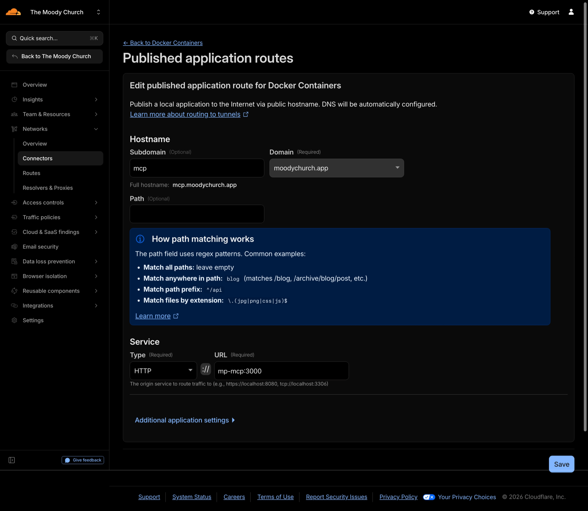
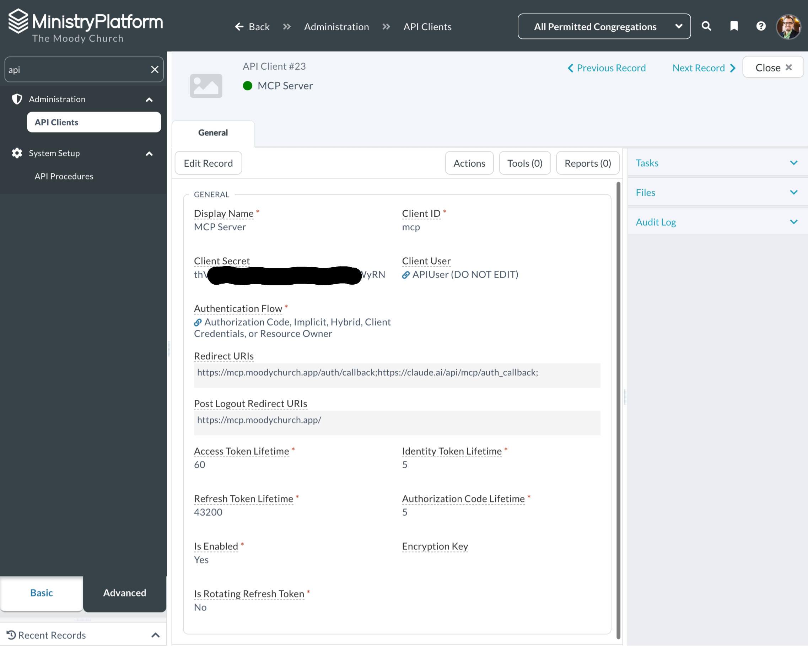
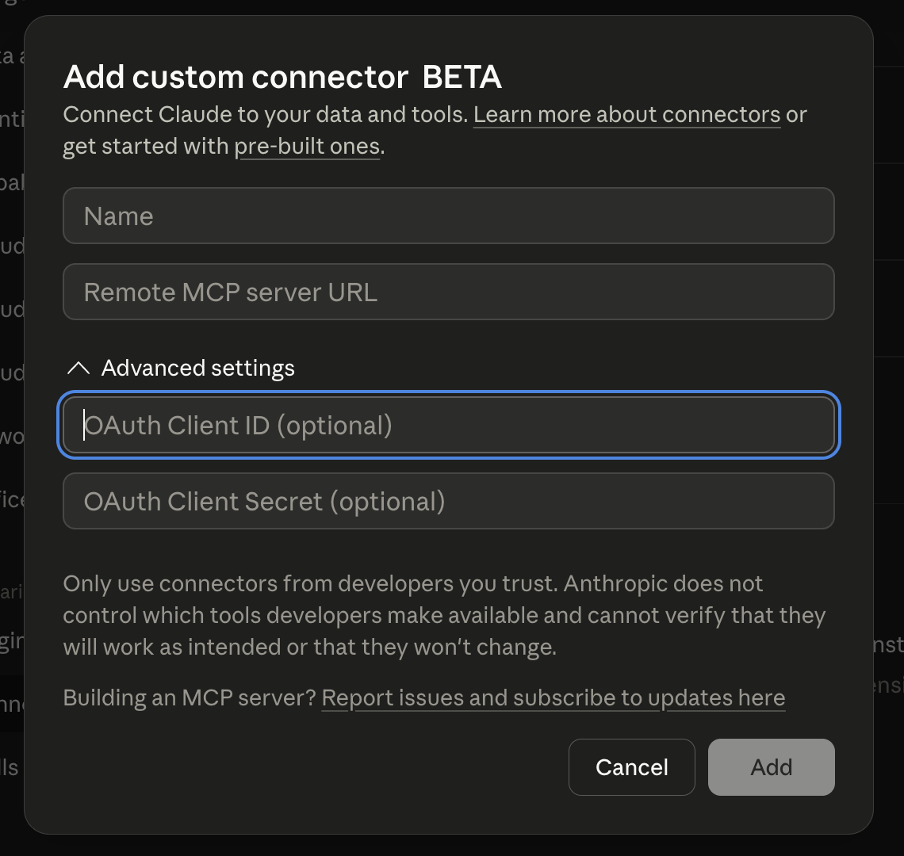

# Ministry Platform MCP Server

An [MCP (Model Context Protocol)](https://modelcontextprotocol.io) server that gives Claude direct access to [Ministry Platform's](https://www.ministryplatform.com) REST API. Connect Claude Desktop to your MP instance and query contacts, events, groups, and other church data conversationally.

Users authenticate with their own MP credentials via OIDC, so they only see data their MP security role permits.

## Quick start (Docker)

### 0. Set up the reverse proxy

You'll need a public DNS hostname for Claude to reach your MCP server. Reverse-proxy that HTTPS hostname to port 3000 of your container — see [Public HTTPS](#public-https) for examples.

### 1. Create the MP API Client

[In MP under **Administration → API Clients**](#1-configure-oidc), create a client and set the **Redirect URIs** to:

```
<PUBLIC_URL>/auth/callback;https://claude.ai/api/mcp/auth_callback;
```

Note the **Client ID** and **Client Secret** for the next step.

### 2. Configure and start the container

In the directory where you want the deployment to live:

```bash
curl -fsSL https://raw.githubusercontent.com/The-Moody-Church/mp-mcp/main/docker-compose.example.yml -o docker-compose.yml
curl -fsSL https://raw.githubusercontent.com/The-Moody-Church/mp-mcp/main/.env.example -o .env
mkdir -p config && curl -fsSL https://raw.githubusercontent.com/The-Moody-Church/mp-mcp/main/config/table-access.example.json -o config/table-access.json

# Edit .env (MP_BASE_URL, OIDC_CLIENT_ID, OIDC_CLIENT_SECRET, PUBLIC_URL):
$EDITOR .env

# Start:
docker compose up -d
```

### 3. Add the connector in Claude's organization settings

In claude.ai, go to [**Organization Settings → Connectors**](https://claude.ai/admin-settings/connectors) and click **Add custom web connector**. Set the **Remote MCP server URL** to `<PUBLIC_URL>/mcp`. See [Connecting Claude](#connecting-claude) for the screenshot and full field reference.

### 4. Each user connects from their personal settings

Each staff user opens [their personal connector settings](https://claude.ai/settings/connectors), finds the Ministry Platform connector, clicks **Connect**, and signs in with their MP credentials.

## Contents

- [Quick start (Docker)](#quick-start-docker)
  - [0. Set up the reverse proxy](#0-set-up-the-reverse-proxy)
  - [1. Create the MP API Client](#1-create-the-mp-api-client)
  - [2. Configure and start the container](#2-configure-and-start-the-container)
  - [3. Add the connector in Claude's organization settings](#3-add-the-connector-in-claudes-organization-settings)
  - [4. Each user connects from their personal settings](#4-each-user-connects-from-their-personal-settings)
- [Features](#features)
- [Prerequisites](#prerequisites)
  - [Public HTTPS](#public-https)
- [Setup](#setup)
  - [1. Configure OIDC](#1-configure-oidc)
  - [2. Configure environment](#2-configure-environment)
  - [3. Configure table allowlist](#3-configure-table-allowlist)
- [Deployment](#deployment)
  - [Option A: Docker (recommended)](#option-a-docker-recommended)
  - [Compose options](#compose-options)
  - [Networking](#networking)
  - [Option B: Node.js (no Docker)](#option-b-nodejs-no-docker)
  - [Option C: Development](#option-c-development)
- [Connecting Claude](#connecting-claude)
  - [1. Add the connector at the organization level](#1-add-the-connector-at-the-organization-level)
  - [2. Each user enables and signs in](#2-each-user-enables-and-signs-in)
- [Available Tools](#available-tools)
- [Security](#security)
  - [Authentication](#authentication)
  - [Permission model](#permission-model)
  - [Table allowlist](#table-allowlist)
  - [No secrets on client machines](#no-secrets-on-client-machines)
  - [Further reading](#further-reading)
- [Endpoints](#endpoints)
- [Releases](#releases)
  - [Channels](#channels)
  - [Cutting a release](#cutting-a-release)
- [Troubleshooting](#troubleshooting)
- [License](#license)

## Features

- **Read-only tools** — list tables, describe fields, query records, get by ID
- **Per-user OIDC auth** — each user signs in with their Ministry Platform credentials
- **Table allowlist** — configurable cap on which tables are exposed, independent of MP security roles
- **Concurrency limiting** — respects MP's connection limits
- **URL length handling** — automatically switches long GET requests to POST fallback
- **No deletes** — the server exposes no delete operations

## Prerequisites

- Node.js 22+
- A Ministry Platform instance with OIDC enabled
- An OIDC client (e.g., `TM.Widgets`) with a redirect URI pointing to your server (configured in [Setup step 1](#1-configure-oidc))
- A public HTTPS URL pointing at the server — see [Public HTTPS](#public-https) below

### Public HTTPS

Claude.ai needs to reach this server over HTTPS, so port 3000 must sit behind a reverse proxy with TLS termination. The proxy's public hostname is what you'll set as `PUBLIC_URL`. Three common options:

**Cloudflare Tunnel** — no port forwarding required; Cloudflare handles the cert.

> This section assumes you already have a Cloudflare Tunnel running on your network (with `cloudflared` connected) and Cloudflare managing your public DNS. If you're starting from scratch, follow [Cloudflare's quickstart for creating a remote tunnel](https://developers.cloudflare.com/cloudflare-one/connections/connect-networks/get-started/create-remote-tunnel/) first, then come back here to publish the route.

Two ways to configure the route:

1. **Dashboard-based** (Cloudflare Zero Trust → Networks → tunnel → Published application routes). If you're running cloudflared as a Docker container on the same network as mp-mcp, set the **Service URL** to the container name and port (e.g., `mp-mcp:3000`) — Docker DNS resolves it inside the network and you don't expose port 3000 on the host at all.

   

2. **YAML-based** (standalone cloudflared on the host).

   ```yaml
   # ~/.cloudflared/config.yml
   tunnel: <your-tunnel-id>
   credentials-file: /path/to/<your-tunnel-id>.json
   ingress:
     - hostname: mcp.your-church.com
       service: http://localhost:3000
     - service: http_status:404
   ```

**Caddy** — auto cert via Let's Encrypt.

```caddyfile
mcp.your-church.com {
    reverse_proxy localhost:3000
}
```

**nginx** — bring your own cert (e.g., certbot).

```nginx
server {
    listen 443 ssl;
    server_name mcp.your-church.com;
    # ssl_certificate / ssl_certificate_key directives here

    location / {
        proxy_pass http://localhost:3000;
        proxy_http_version 1.1;
        proxy_buffering off;          # MCP uses streamable HTTP
        proxy_set_header Host $host;
        proxy_set_header X-Forwarded-For $proxy_add_x_forwarded_for;
        proxy_set_header X-Forwarded-Proto $scheme;
    }
}
```

## Setup

> **Reference values for The Moody Church's deployment** (used as examples throughout this section):
>
> - `MP_BASE_URL` → `https://moody.ministryplatform.com`
> - `PUBLIC_URL` → `https://mcp.moodychurch.app`
>
> Substitute your own values where you see `<MP_BASE_URL>` / `<PUBLIC_URL>` placeholders or generic examples like `your-church.ministryplatform.com`.

### 1. Configure OIDC

Ministry Platform's OAuth/OIDC clients live under **Administration → API Clients** (search "api" in the MP admin to find it quickly). Create a new API Client for the MCP server using the following settings:



| Field | Value | Notes |
|---|---|---|
| **Display Name** | `MCP Server` | Any human-readable label. |
| **Client ID** | your choice (e.g., `mcp`) | Copy into `.env` as `OIDC_CLIENT_ID`. |
| **Client Secret** | (auto-generated by MP) | Copy into `.env` as `OIDC_CLIENT_SECRET`. |
| **Client User** | `APIUser` (or your install's standard API user) | Acts as the upper-bound **ceiling** on what *any* signed-in user can do through this connector — MP won't let mp-mcp make calls beyond what this user's role permits, regardless of the signed-in user's own role. Pick a user whose role meets or exceeds the most permissive access you want surfaced through Claude. Individual API calls are attributed to the actual signed-in user in MP's audit log, not to this user — per-user accountability holds even with writes enabled. |
| **Authentication Flow** | must include **Authorization Code** | mp-mcp uses Authorization Code only; the other flows can stay enabled or be narrowed to just Auth Code. |
| **Redirect URIs** | `<PUBLIC_URL>/auth/callback;https://claude.ai/api/mcp/auth_callback;`<br>(for TMC: `https://mcp.moodychurch.app/auth/callback;https://claude.ai/api/mcp/auth_callback;`) | Semicolon-separated. The first entry must exactly match the `PUBLIC_URL` you'll set in `.env`; the second is the Claude.ai callback for dynamic client registration. Must end with a **semicolon**. |
| **Post Logout Redirect URIs** | `<PUBLIC_URL>/;` | Optional — only used if you implement an explicit logout flow. Must end with a **semicolon**. |
| **Access Token Lifetime** | `60` (minutes) | One hour. Lower means more frequent silent re-auth. |
| **Identity Token Lifetime** | `5` (minutes) | Default is fine. |
| **Refresh Token Lifetime** | `43200` (minutes = 30 days) | Default is fine. |
| **Authorization Code Lifetime** | `5` (minutes) | Default is fine. |
| **Is Enabled** | `Yes` | Required. |
| **Is Rotating Refresh Token** | `No` | Default is fine; flip to `Yes` if your security posture requires it. |

**Scopes** — not visible on the General tab. mp-mcp uses `openid`, `offline_access`, and `http://www.thinkministry.com/dataplatform/scopes/all`. If your MP install requires explicit scope authorization on the API Client (typically a separate tab or section), enable all three. Login will fail with a scope-related error if any are missing.


### 2. Configure environment

Copy the example env file and fill in your values:

```bash
cp .env.example .env
```

| Variable | Description |
|----------|-------------|
| `MP_BASE_URL` | Your MP base URL — no trailing slash, no `/ministryplatformapi` suffix (the server appends that prefix automatically when calling the REST API).<br>Example: `https://your-church.ministryplatform.com`<br>For TMC: `https://moody.ministryplatform.com` |
| `OIDC_CLIENT_ID` | The OIDC client ID — matches the **Client ID** field on your MP API Client (e.g., `mcp`, `TM.Widgets`) |
| `OIDC_CLIENT_SECRET` | The OIDC client secret — copied from the **Client Secret** field on your MP API Client |
| `PUBLIC_URL` | The public URL where this server is hosted.<br>Example: `https://mcp.yourchurch.com`<br>For TMC: `https://mcp.moodychurch.app` |
| `PORT` | Server port (default: `3000`) |
| `ALLOWED_USER_GROUP_IDS` | (Optional) Comma-separated MP User Group IDs. Only users in these groups can log in. Leave empty to allow any authenticated MP user. |
| `ALLOWED_REDIRECT_URIS` | (Optional) Comma-separated https URIs accepted for dynamic OAuth client registration in addition to the built-in `https://claude.ai/api/mcp/auth_callback`. |
| `MEMBER_FILTER` | (Optional) SQL filter snippet identifying "members" at this church (e.g., `Member_Status_ID = 1` or `Participant_Type_ID = 4`). Surfaced to Claude as a domain convention so it doesn't have to guess. Leave empty to make Claude ask before assuming. |
| `TOOL_LOG_PATH` | (Optional) Path to a JSONL file. When set, every tool call appends `{ ts, user_id, user_name, tool, args, duration_ms, ok, error? }`. Args are logged in full — keep this on a host-local volume. Leave empty to disable. |

### 3. Configure table allowlist

Copy the example and customize which tables to expose:

```bash
cp config/table-access.example.json config/table-access.json
```

Edit `config/table-access.json` to include only the tables you want accessible through Claude. Each table can be set to read-only or read-write:

```json
{
  "Contacts": { "read": true, "write": false },
  "Events": { "read": true, "write": false }
}
```

Tables not listed are blocked entirely, regardless of the user's MP security role.

**Sensitive tables excluded from the example** — you can add these back if you need them, but they carry extra risk:

- `dp_Users` — auth metadata including password-reset tokens and hash columns. Not required for group-membership checks (the server queries it directly with the user's OIDC token outside the allowlist).
- `Background_Checks` — criminal-history data. High downside if a misconfigured role exposes them through the REST API.
- `Form_Responses` — freeform user-submitted text. High PII density and a prompt-injection surface for anything downstream of Claude.

## Deployment

### Option A: Docker (recommended)

```bash
# Copy and configure
cp docker-compose.example.yml docker-compose.yml
cp .env.example .env
cp config/table-access.example.json config/table-access.json

# Edit .env with your credentials and settings
# Edit config/table-access.json with your table allowlist

# Run
docker compose up -d
```

After the container starts, smoke-test the server:

```bash
curl https://your-mcp-domain.example.com/health
# {"status":"ok"}
```

If the health check fails, inspect logs:

```bash
docker compose logs mp-mcp
```

Or build the image locally:

```bash
docker build -t mp-mcp .
docker run -p 3000:3000 --env-file .env -v ./config/table-access.json:/app/config/table-access.json:ro mp-mcp
```

### Compose options

What's in the example `docker-compose.yml` and what you might change:

| Setting | Default | When to change it |
|---|---|---|
| `image:` | `ghcr.io/the-moody-church/mp-mcp:latest` | Pin to a specific version (`:0.1.0`) or channel (`:0.1`, `:main`, `:dev`) — see [Releases](#releases). |
| `ports:` | `"3000:3000"` | Drop this entirely if your reverse proxy reaches mp-mcp via a shared Docker network (see [Networking](#networking) below). |
| `volumes:` | `./config/table-access.json` (read-only) and `./data` (read-write) | Allowlist mount is required. `./data` is only needed if `TOOL_LOG_PATH` is set in `.env`. |
| `env_file:` | `.env` | All required env vars live in `.env` — see [Setup → 2. Configure environment](#2-configure-environment). |
| `restart:` | `unless-stopped` | Keep this — auto-recovers from crashes and host reboots. |
| `build:` | (commented out) | Uncomment if you'd rather build the image locally than pull from GHCR. |

### Networking

The example file doesn't declare an explicit Docker network. Pick the pattern that matches where your reverse proxy lives:

**A. Reverse proxy on the host** (cloudflared / nginx / Caddy as a system service). The default `ports: "3000:3000"` mapping is sufficient — your proxy points at `http://localhost:3000` or the host's IP.

**B. Reverse proxy in Docker on the same host** (cloudflared / Caddy / nginx running as a container). Attach mp-mcp to the proxy's external network so the proxy can resolve it by container name, and drop the `ports:` stanza so port 3000 isn't exposed on the host at all:

```yaml
# Add to docker-compose.yml:
networks:
  cloudflared:
    external: true
    name: cloudflared_containers   # whatever your reverse-proxy network is called

services:
  mp-mcp:
    # ... (rest of the service definition)
    networks:
      - cloudflared
    # Remove the `ports:` block — the reverse proxy reaches us via the network.
```

For TMC the reverse-proxy network is `cloudflared_containers` and cloudflared points at `http://mp-mcp:3000` — exactly what the [Cloudflare Tunnel route screenshot](#public-https) shows.

### Option B: Node.js (no Docker)

```bash
# Install and build
npm install
npm run build

# Run
npm start
```

For production without Docker, use a process manager:

```bash
# With PM2
npm install -g pm2
pm2 start dist/index.js --name mp-mcp

# Or with systemd (create a service file)
```

### Option C: Development

```bash
npm run dev
```

This uses `tsx` to watch for changes and restart automatically.

## Connecting Claude

Setup is two stages, and the flow is the same in claude.ai (web) and Claude Desktop — both share the connectors model.

> **Note:** mp-mcp is designed for use in regular Claude conversations via the connectors UI in claude.ai and Claude Desktop. It can hypothetically be wired into Claude Code via local MCP config, but that path is untested.

### 1. Add the connector at the organization level

Go to [**Organization Settings → Connectors**](https://claude.ai/admin-settings/connectors) and click **Add custom web connector**. Fill in the dialog:



| Field | Value |
|---|---|
| **Name** | Anything readable, e.g., `Ministry Platform` |
| **Remote MCP server URL** | `<PUBLIC_URL>/mcp` — for TMC: `https://mcp.moodychurch.app/mcp` |
| **OAuth Client ID / Secret** (Advanced settings) | Leave blank — Claude registers dynamically with mp-mcp via the MCP auth protocol |

This makes the Ministry Platform connector available to everyone in the org. It does not sign anyone in.

### 2. Each user enables and signs in

Each staff user opens [their personal connector settings](https://claude.ai/settings/connectors), finds the Ministry Platform connector in the list, and clicks **Connect**. That opens MP's standard sign-in page in a browser; after a successful login they're returned to Claude, and the connector's settings page now shows it as **Connected** along with the list of available tools.

Each user signs in with their own MP credentials, so the data they see through Claude matches what their MP security role already permits in the MP web UI.


## Available Tools

Domain tools (preferred — they bake in the right FK joins and disambiguation):

| Tool | Description |
|------|-------------|
| `find_people` | Search contacts by name, email, or phone |
| `get_person_details` | Full profile: contact info, group memberships, recent attendance |
| `search_groups` | Search groups by name, type, or ministry |
| `get_group_roster` | Members of a group with roles and dates |
| `get_group_attendance_summary` | Per-participant attendance over one or two date windows; supports drift-detection thresholds |
| `search_events` | Search events by date range, name, or program |
| `get_event_attendance` | Attendees + pivoted Event_Metrics for an event |
| `get_schedule` | Events on a date / range with rooms already joined; accepts `today` / `tomorrow` / `this_sunday` / `this_week` |
| `get_attendance_summary` | Aggregate Event_Metrics for a recurring service across year / month / week / per-service buckets |

Aggregation helpers (use these instead of pulling rows to count them):

| Tool | Description |
|------|-------------|
| `count_rows` | `{ count: N }` for a table + filter — paginates server-side |
| `group_by_count` | `{ groups: [{value, count}, ...], total }` — bucket by any column or FK join |
| `birth_date_range_for_age` | Convert an age range into a Date_of_Birth filter snippet (handles the calculated-Age problem) |

Generic fallbacks (power-user / ad-hoc):

| Tool | Description |
|------|-------------|
| `list_tables` | List allowlisted tables |
| `describe_table` | Field names and types; surfaces `fk_join_prefix` / `lookup_table` for FK columns |
| `query_table` | Raw filtered query; response wrapped as `{ data, row_count, has_more, next_skip }` |
| `get_record` | Fetch a single record by ID |

### Query examples

Claude can use these tools naturally. For example:

- "What's on the schedule tomorrow?"
- "Year-over-year attendance for the Sunday Morning Service"
- "Mosaic group members who came consistently last fall but haven't this spring"
- "How many active members are 65–69?"
- "Look up the contact record for John Smith"

### Query syntax

The `query_table` tool supports Ministry Platform's query parameters:

- **`$filter`** — SQL WHERE syntax: `Display_Name LIKE '%Smith%'`, `Event_Start_Date > GETDATE()`
- **`$select`** — Column names: `Contact_ID, Display_Name, Email_Address`
- **`$orderby`** — Sort: `Display_Name` or `Event_Start_Date DESC`
- **`$top`** / **`$skip`** — Pagination (max 1000 per request)
- **FK joins** — `Contact_ID_Table.Display_Name`, `Event_ID_Table.Event_Title`

## Security

### Authentication

Users authenticate via OIDC with their Ministry Platform credentials. The server uses the user's own access token for all MP API calls, so MP's security roles enforce what data they can see — the same permissions they have in the MP web UI.

### Permission model

Three independent ceilings constrain what any signed-in user can do through mp-mcp; effective access is the **intersection**:

1. **The API Client's Client User** (configured in MP) — caps what *any* user authenticating through this connector can do, regardless of the signed-in user's own role.
2. **The signed-in user's MP Security Role** — standard per-user role-based access control. Each user only sees what their MP role permits, exactly as in the MP web UI.
3. **`config/table-access.json`** — the MCP server's own allowlist. Even if MP would permit a call, mp-mcp blocks it for tables that aren't listed.

To keep these layers aligned, the recommended pattern is to create a dedicated **MP Security Role** — for example, *MCP Connector* — that grants **Read** on every table in `config/table-access.json`. Then:

- Assign the role to the **Client User** on the API Client (raises the layer-1 ceiling).
- Assign the role (or roll it into a parent role) to every **staff user** who should use Claude (clears layer 2 for them).

<details>
<summary><strong>Tables to grant Read on</strong> (mirrors the sections in <code>config/table-access.example.json</code> — drop rows for any sections you remove from the allowlist)</summary>

| Section | Tables |
|---|---|
| **Required** (built-in domain tools) | `Contacts`, `Groups`, `Group_Participants`, `Events`, `Event_Participants`, `Event_Metrics`, `Event_Rooms` |
| Person + household lookups | `Contact_Statuses`, `Genders`, `Marital_Statuses`, `Prefixes`, `Suffixes`, `Life_Stages`, `Household_Positions`, `Household_Sources`, `Household_Types`, `Congregations` |
| Participant / engagement / membership | `Participants`, `Participant_Engagement`, `Participant_Milestones`, `Participant_Certifications`, `Participant_Types`, `Participation_Statuses`, `Member_Statuses`, `Milestones`, `Contact_Log`, `Contact_Log_Types` |
| Group context | `Group_Types`, `Group_Roles`, `Group_Role_Types`, `Group_Ended_Reasons`, `Group_Focuses`, `Meeting_Days`, `Meeting_Frequencies`, `Meeting_Durations` |
| Event / room context | `Event_Types`, `Metrics`, `Rooms`, `Room_Layouts`, `Buildings` |
| Programs / ministries | `Priorities`, `Programs`, `Program_Types`, `Service_Types`, `Ministries` |
| User / background-check lookups | `Background_Check_Types`, `dp_User_Roles`, `dp_User_User_Groups` |
| Activity tracking | `Activity_Log` |

</details>

When you later expand the allowlist, you only need to add the new table to this role and to the JSON file — everyone with the role picks it up automatically.

> **Terminology heads-up:** in MP, table-level permissions live on **Security Roles**, not **User Groups**. The `ALLOWED_USER_GROUP_IDS` env var filters *who* can sign in to mp-mcp; it does **not** grant or deny table access. Security Roles govern table access.

### Table allowlist

`config/table-access.json` is the layer-3 ceiling described above — the place to opt out of sensitive tables (e.g., `Donations`, `Background_Checks`, `Form_Responses`) even when a user's MP role would otherwise grant access. See [Setup → 3. Configure table allowlist](#3-configure-table-allowlist) for the file format and the tables intentionally excluded from the example.

### No secrets on client machines

The MCP server URL is the only thing configured on staff machines. All credentials and tokens are managed server-side.

### Further reading

See [`docs/security-posture.md`](docs/security-posture.md) for the full control inventory, `query_table` power-user guidance, and documented accepted risks.

## Endpoints

| Path | Method | Description |
|------|--------|-------------|
| `/mcp` | POST/GET/DELETE | MCP streamable HTTP endpoint |
| `/auth/login` | GET | Initiates OIDC login flow |
| `/auth/callback` | GET | OIDC redirect callback |
| `/auth/logout` | GET | Ends session |
| `/health` | GET | Health check |

## Releases

Images are published to `ghcr.io/the-moody-church/mp-mcp` on every push to any branch and on every git tag matching `v*`.

### Channels

| Tag | Updates on | Use for |
|-----|-----------|---------|
| `:latest` | a new stable release is tagged | production (default) |
| `:0`, `:0.2` | a release in that major/minor is tagged | production, pinned to a major or minor line |
| `:0.2.0` | never (immutable) | production, pinned to an exact release |
| `:main` | every push to `main` | testing the latest merged commit |
| `:dev` | every push to any non-`main` branch | previewing a PR before it merges |
| `:sha-abc1234` | never (immutable) | reproducing a specific commit's behavior |

`:latest` only moves when a release is cut — it does **not** track every push to `main`. The default `image:` line in `docker-compose.example.yml` uses `:latest`, which is fine for most deployments. If you want a slower roll, pin to a minor (`:0.1` — auto-picks up patch releases) or to an exact version (`:0.1.0`, immutable).

Restarting the container to pick up a new image is non-disruptive in normal use — Claude clients reconnect to the MCP server on the next tool call, so users typically just retry their next prompt.

`:dev` is single-tenant — whichever non-`main` branch was pushed most recently wins. If you have multiple PRs in flight and need to test a specific one, use that PR's `:sha-<short>` tag instead.

### Cutting a release

Releases are git-tag driven. To cut `v0.2.0`:

```bash
git tag -a v0.2.0 -m "v0.2.0"
git push origin v0.2.0
```

The push triggers the workflow, which builds the image and tags it `:0.2.0`, `:0.2`, `:0`, and `:latest`. Pre-release identifiers (`v0.2.0-rc.1`) are also accepted by `docker/metadata-action`'s semver matcher and produce only the exact tag (no `:latest` move).

Keep `package.json` `version` in sync with the git tag when you cut one.

## Troubleshooting

| Symptom | Likely cause | Fix |
|---|---|---|
| Every MP API call returns 404 | `MP_BASE_URL` has a trailing slash, or includes `/ministryplatformapi` | Set the bare URL: `https://your-church.ministryplatform.com` (no slash, no path) |
| OIDC login fails: "redirect_uri not registered" | The redirect URI configured in MP admin doesn't exactly match `PUBLIC_URL/auth/callback` | Add `https://your-mcp-domain.example.com/auth/callback` to your OIDC client in MP admin |
| OIDC login redirects to the wrong host | `PUBLIC_URL` doesn't match the public hostname your reverse proxy serves | Set `PUBLIC_URL` to the public HTTPS hostname, no trailing slash |
| Login succeeds but no tools work / Claude can't list tools | Reverse proxy is buffering streamable HTTP responses | Disable buffering in the proxy (e.g., `proxy_buffering off` in nginx) |
| `Table 'X' is not allowed` from a tool call | Table missing from `config/table-access.json` | Add it with `"X": { "read": true, "write": false }` and restart the container |
| `ALLOWED_USER_GROUP_IDS` blocks every login | Typo in the comma-separated IDs, or no current user is in any of the listed groups | Verify IDs in MP admin (System Setup → User Groups) and that the user is a member |
| `curl /health` works locally but Claude can't reach the server | DNS / proxy not actually routing the public hostname to port 3000 | Test from outside the network: `curl https://your-mcp-domain/health` |
| Container starts then exits immediately | Missing required env var, or `config/table-access.json` not mounted | Run `docker compose logs mp-mcp` — the error message names the missing piece |

## License

MIT
